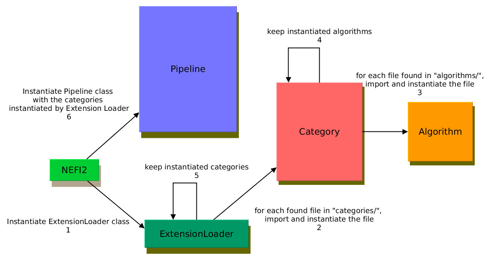

Quick Start Guide for developers
================================

Keep in mind that hopefully this project is in its early stages and even though we tried our best it has bugs and some documentation still needs to be added, so don't be shy and report bugs on our `Github page <http://www.github.com/???`_.

NEFI2 is built with `MVC pattern <insert a link>`_, so you will find familiar directories like "model", "view" and "controller".

.. figure::  images/nefi2.png
   :align:   center
   :scale: 85%

