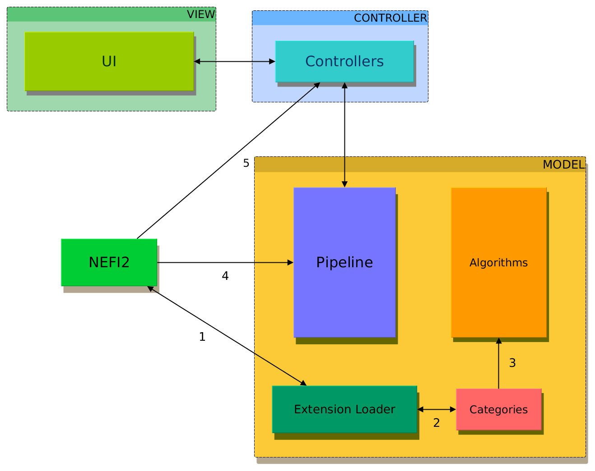

.. _user_guide:

Quick Start Guide for developers
================================

NEFI2 is built with `MVC pattern <https://en.wikipedia.org/wiki/Model%E2%80%93view%E2%80%93controller>`_, so you will find familiar directories like "model" and "view" (we removed "controller" in latest versions) inside the project repository.

Basically, the most important files you need to know about are:

::
  model/pipeline.py
  model/ext_loader.py
  view/controller.py
  view/MainView.ui

.. figure::  images/pipeline_start.png
   :align:   center
   :scale: 85%

Keep in mind that this project is in its early stages and even though we tried our best it has bugs, so don't be shy add report bugs on our `Github page <http://www.github.com/???`_.
