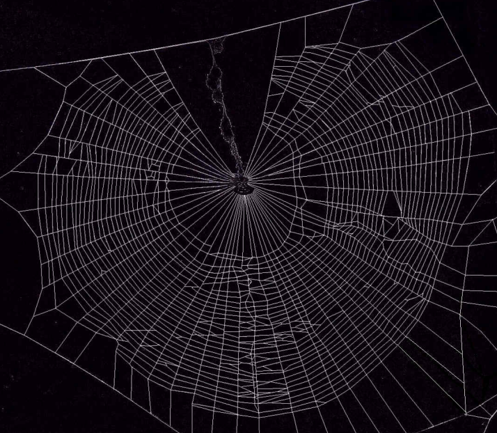
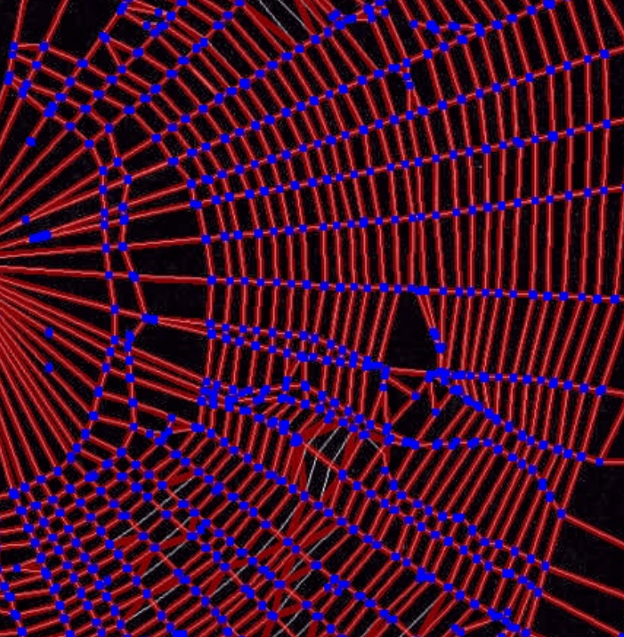
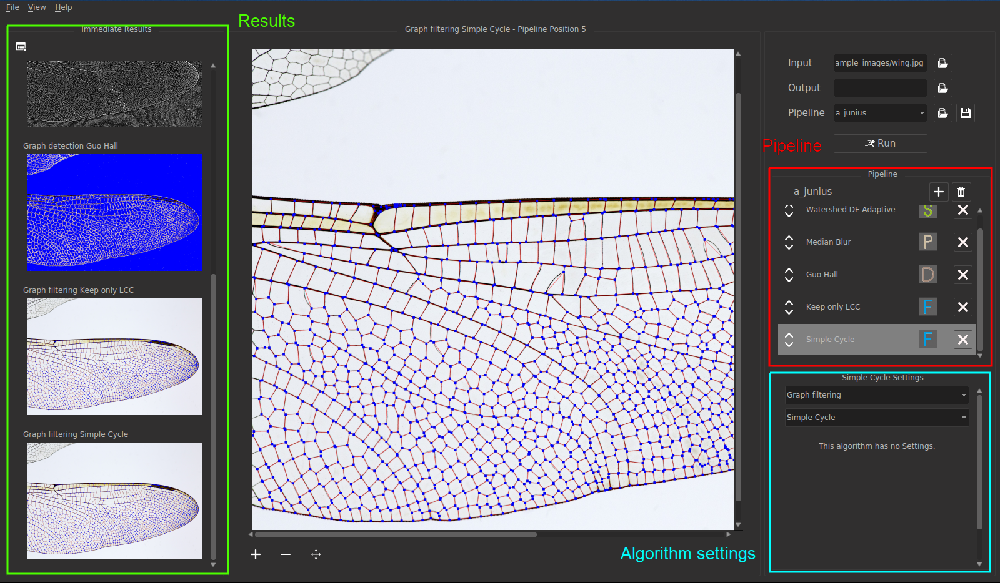

.. _user_guide:

Quick Start Guide for users
===========================

So, you want to know what is NEFI2 good for now? Currently it is good for extracting networks from images.
Imagine you have a big collection of spider webs pictures and you want to do an interesting research on how different are the web structures of Cross and Banded Garden spider.
You spend some time on collecting a *statistically significant* amount of images and... attempt to understand the differences by looking through the collection.
Well, really?
No, you better delegate this task to NEFI2.

NEFI2 is capable of batch processing a large collection of images and extracting a `NetworkX graph objects <https://networkx.github.io/documentation/latest/reference/introduction.html>`_ that you can use later to process and get numerical data or even train a spider web recognizer.

There are 3 main components in NEFI2 that you need to know about: **Pipeline**, **Categories** and **Algorithms**.
**Pipeline** contains **Categories** which in turn contain **Algorithms**.
**Category** is a collection of algorithms that fulfill specific image processing task.

**Categories**
++++++++++++++++++++++++

  | *Preprocessing* (P) <-- contains various preprocessing algorithms
  | *Segmentation* (S) <-- contains algorithms for image segmentation, e.g. "Otsus's Threshold"
  | *Graph Detection* (D) <-- contains graph detection procedures based on "Guo & Hall" thinning algorithm
  | *Graph Filtering* (F) <-- contains various graph pruning algorithms, e.g. "Keep Largest Connected Component"

**Algorithms**
++++++++++++++

  | **Abbreviated UI name**  --> **Full name**
  |
  | *Bilateral* --> Bilateral Filter (P)
  | *Blur*  -->   Blur (P)
  | *Color Enchance* --> Color Enchancement (P)
  | *Gauss Blur* --> Gaussian Blur (P)
  | *FM Denoise* --> Fast nl Means Denoising (P)
  | *FM Denoise Color* --> Fast nl Means Denoising Colored (P)
  | *Invert Color* --> Invert Color (P)
  | *Median Blur* --> Median Blur (P)
  |
  | *Adaptive* --> Adaptive Threshold (S)
  | *Constant* --> Constant Threshold (S)
  | *Grabcut DE Otsus* --> Grabcut - Dilation Erosion Otsu (S)
  | *Grabcut DT Otsus* --> Grabcut with Distance Transform and Otsu's Threshold (S)
  | *Otsus* --> Otsu's Threshold (S)
  | *Watershed DE Adaptive* --> Watershed with Dilation, Erosion and Adaptive Threshold (S)
  | *Watershed DE Otsus* --> Watershed with Dilation, Erosion and Otsu's Threshold (S)
  | *Watershed DT Otsus* --> Watershed with Distance Transform and Otsu's Threshold (S)
  |
  | *Guo Hall* --> Guo Hall thinning (D)
  |
  | *Connected Component* --> Connected Component Filter (F)
  | *Edge Attribute* --> Edge Attribute Filter (F)
  | *Keep only LCC* --> Keep only largest connected component (F)
  | *Simple Cycle* --> Simple Cycle Filter (F)
  | *Smooth 2 Nodes* --> Smooth Degree 2 Nodes Filter (F)

Generally, you select an image, load a saved pipeline or create your own (using **'+'** buttons).
When you hit "Run" button, the **Pipeline** takes the image and runs it through the selected **Categories** one by one.
The result is saved into the specified directory.
In order to extract the Graph (network) from the selected image you only need to add *Segmentation* and *Graph Detection* to the **Pipeline**, but using only *Segmentation* and *Graph Detection* might not produce good results if the image is of poor quality or noisy.
That is why you need *Preprocessing* and *Graph Filtering*.

Make yourself familiar with NEFI2 interface.

On the top right, you can choose the output directory where NEFI2 stores its results.
By default the results are stored in **output/pipeline_name_image_name**.
You can also load/save the **Pipeline**.
Yes, the **Pipeline** can be saved and loaded later.
It is saved on disk in **json** format, so you can easily create a new or edit the existing one (see :ref:`create_pip`).

In the **Pipeline** panel you add/remove your **Categories** and assign the **Algorithms**.
Each **Category** is created to be empty, you need to select an active **Algorithm** for it.
The order of the **Categories** is important.
That is why when you hit "Run", incorrectly positioned will be highlighted with red.

In the **Algorithm settings** panel you fine-tune currently selected **Algorithm**.
After the first run, if you replace or change the selected **Algorithm**, the **Pipeline** will not be reprocessed from the very beginning but from the first modified **Algorithm** (this saves resources and your time).

The left panel is self-explanatory.
Here the result of each **Algorithm** is displayed.
When the panel accumulates too many images you can click "Clear" button on the top left to clear the results.

That's it, now you know everything you need to use NEFI2.
